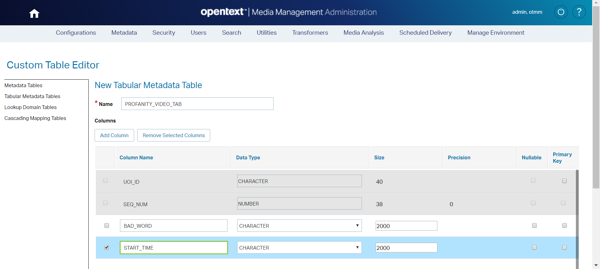
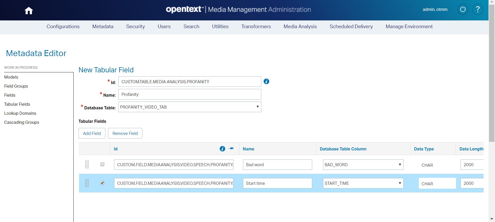
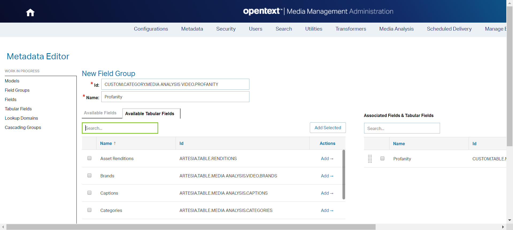
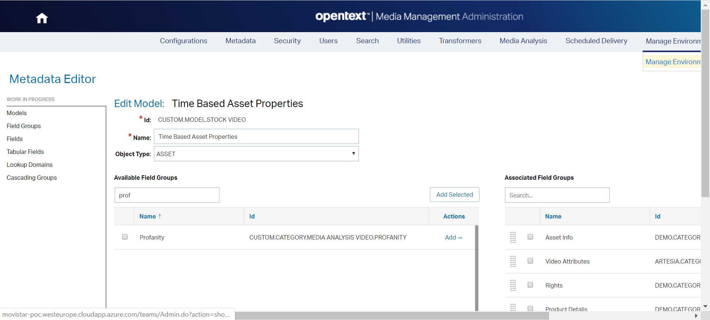

# OpenText Media Management (OTMM) Profanity detection
OTMM Event listener which listen the event **Analysis data from Azure is deleted (5006)**.
This event is launched once the Rich Media Analysis (RMA) has finished.  

> NOTE: The data from Azure is deleted regardless of whether the extraction of media analytics succeeded or not.

Once the Analysis data from Azure is deleted the transcription is available (only when the RMA has finished successfully).

This add-on search for bad words in the video transcription, stored on **ARTESIA.FIELD.MEDIAANALYSIS.VIDEO.SPEECH.TEXT** field.
If some bad words are found, It are stored in this custom fields: 

 * **CUSTOM.FIELD.MEDIAANALYSIS.VIDEO.SPEECH.PROFANITY.BAD.WORD**
 * **CUSTOM.FIELD.MEDIAANALYSIS.VIDEO.SPEECH.PROFANITY.START.TIME**

> NOTE: These custom field must be created from TEAMS admin panel.

# Event handler registration
## Register event listener
1.	Copy this paragraph:
``` 

<!-- Custom event listener (Profanity detection) -->
<listener>
	<listener-class>com.opentext.otmm.sc.evenlistener.AnalysisDataFromAzureIsDeletedEventListenerRegistration</listener-class>
</listener>

```
 
2.	Open **web.xml** file located at **C:\Apps\MediaManagement\ear\artesia\otmmux\WEB-INF**
3.	Paste the paragraph under the **web-app** label

## Deploy event listener classes
1.	Copy the folder structure under the **&lt;PROJECT_HOME&gt;\bin**
2.	Paste the **com** folder under **C:\Apps\MediaManagement\ear\artesia\otmmux\WEB-INF\classes**

## log4j.xml

Log4j is a simple and flexible logging framework. The most common configuration options issuing  log4j.xml

Follow these steps:
1.	Copy these text:
``` 
<!-- Custom added by Joaquín -->
			
		
<logger name="ccom.opentext.otmm.sc.evenlistener">
	<level name="DEBUG"/>
	<appender-ref ref="console" />
	<appender-ref ref="file" />
</logger>
			
<logger name="com.opentext.otmm.sc.evenlistener.handler">
	<level name="DEBUG"/>
	<appender-ref ref="console" />
	<appender-ref ref="file" />
</logger>
			
<logger name="com.opentext.otmm.sc.evenlistener.helper">
	<level name="DEBUG"/>
	<appender-ref ref="console" />
	<appender-ref ref="file" />
</logger>
			
<logger name="com.opentext.otmm.sc.evenlistener.util">
	<level name="DEBUG"/>
	<appender-ref ref="console" />
	<appender-ref ref="file" />
</logger>
			
<logger name="com.opentext.otmm.sc.modules.profanitydetector">
	<level name="DEBUG"/>
	<appender-ref ref="console" />
	<appender-ref ref="file" />
</logger>
``` 
2.	Paste the paragraph before the **&lt;/log4j:configuration&gt;** label into **C:\Apps\TomEE-OTMM\conf\log4j.xml**

# Media Management Administration

In order to store the bad words said in the video you must create some metadata.

## Create a Tabular Metadata table: PROFANITY_VIDEO_TAB

1. Access to TEAMS (<OTMM_SERVER>/teams)
2. Browse to **Metadata > Custom table editor** at the top menu
3. Click on **Tabular Metadata tables** at the left menu
4. Click on **New Tabular Metadata table** button
5. Create a new table called: **PROFANITY_VIDEO_TAB**
6. Add two new fields:
   * BAD_WORD (CHARACTER)
   * START_TIME (CHARACTER)
7. Click on **Save** button
      


## Create a Tabular Field: CUSTOM.TABLE.MEDIA ANALYSIS.PROFANITY	

1. Browse to **Metadata > Metadata editor** at the top menu
2. Click on **Tabular Fields** at the left menu
3. Click on **New Tabular Field** button
4. Create a new tabular field called: **CUSTOM.TABLE.MEDIA ANALYSIS.PROFANITY**
   * **Id**:	CUSTOM.TABLE.MEDIA ANALYSIS.PROFANITY
   * **Name**:	Profanity
   * **Database Table**: PROFANITY_VIDEO_TAB
Tabular Fields
5. Add two new fields:
   * CUSTOM.FIELD.MEDIAANALYSIS.VIDEO.SPEECH.PROFANITY.BAD_WORD
   * CUSTOM.FIELD.MEDIAANALYSIS.VIDEO.SPEECH.PROFANITY.START.TIME
6. Click on **Save** button
      


## Create a Field Group: CUSTOM.CATEGORY.MEDIA ANALYSIS VIDEO.PROFANITY		

1. Browse to **Metadata > Metadata editor** at the top menu
2. Click on **Field Groups** at the left menu
3. Click on **New Field Group** button
4. Create a new tabular Field group called: **CUSTOM.CATEGORY.MEDIA ANALYSIS VIDEO.PROFANITY**
   * **Id**:	CUSTOM.CATEGORY.MEDIA ANALYSIS VIDEO.PROFANITY
   * **Name**:	Profanity
5. Click on **Available Tabular Fields** tab
6. Search **Profanity** field
7. Select **Profanity** field 
8. Click on **Add selected** button   
9. Click on **Save** button



## Edit Model: Time Based Asset Properties (CUSTOM.MODEL.STOCK VIDEO)		

1. Browse to **Metadata > Metadata editor** at the top menu
2. Click on **Models** at the left menu
3. Click on **Edit** link close to **Time Based Asset Properties (CUSTOM.MODEL.STOCK VIDEO)**
4. Search **Profanity** field 
5. Select **Profanity** field 
6. Click on **Add selected** button  
7. Click on **Save** button



> NOTE: You can add the Field Group to all the Models that require this information

## Validate and apply changes		

Once we have created all the metadata you must deploy your changes in your OTMM instance.

1. Browse to **Metadata > Metadata editor** at the top menu
2. Click on **Validate** button at the bottom of the screen 
3. Click on **Apply** button at the bottom of the screen

# Required .jar files

> This section is only included to know the original location of the .jar files used in the project.

Import the indicated set of files to the indicated project folders:

**Set 1**
1. From: **C:\Apps\MediaManagement\jars**
 - artesia-server-tools.jar 
 - commons-httpclient-3.1.jar
 - commons-io-1.4.jar 
 - commons-logging-1.1.1.jar
 - TEAMS-common.jar
 - TEAMS-mock-services.jar
 - TEAMS-sdk.jar
 - TEAMS-toolkit.jar
 
2. To project folder: **lib**

**Set 2**
1. From: **C:\Apps\TomEE-OTMM\lib**
 - servlet-api.jar
 
 2. To project folder: **lib**

**Set 3**
1. From: **C:\Apps\MediaManagement\deploy\commons**
 - commons-collections-2.1.1.jar 
 - commons-collections4-4.1.jar 
 - commons-fileupload-1.3.3.jar 
 - commons-lang-2.4.jar 
2. To project folder: **lib**

**Set 4**
1. From: **C:\Apps\MediaManagement\deploy\artesia**
 - otmm-rest-interfaces.jar
 - otmm-server-ext-api.jar
2. To project folder: **lib**


**Set 4**
1. From: **C:\Apps\MediaManagement\ear\artesia.ear\**
 - artesia-ejb.jar
2. To project folder: **lib**
